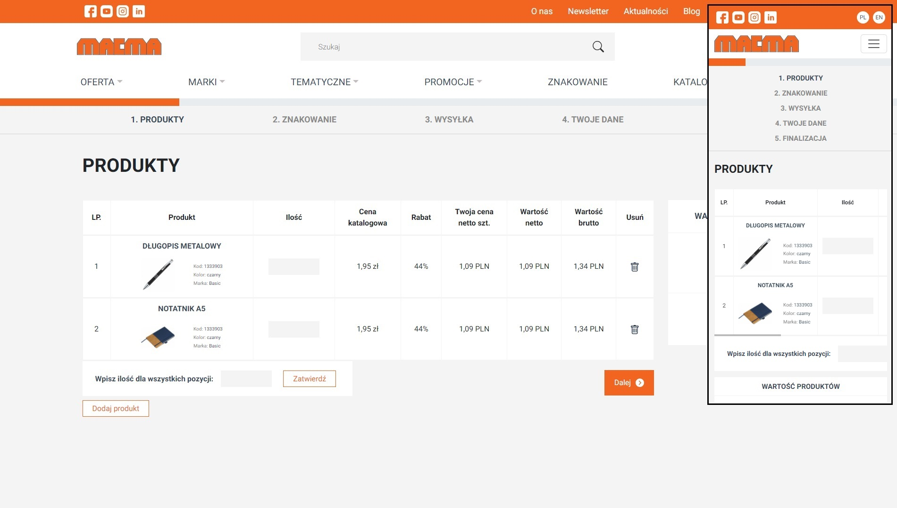
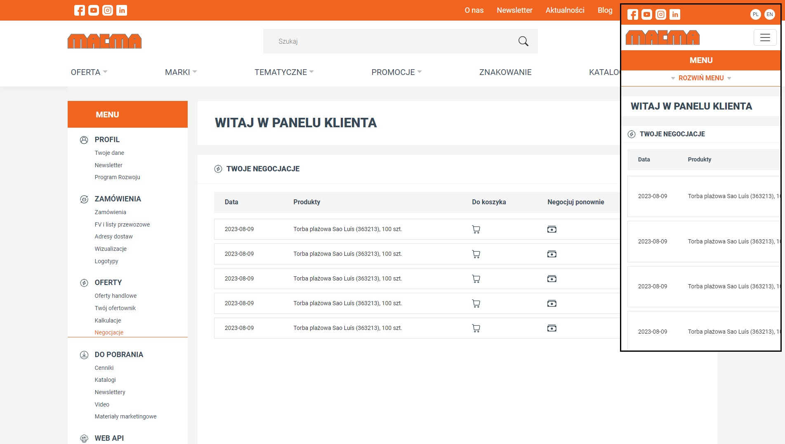

## Table of contents
* [General info](#general-info)
* [Technologies](#technologies)
* [Gif desktop website presentation](#gif-desktop-website-presentation)
* [Gif mobile website presentation](#gif-mobile-website-presentation)
* [License](#license)
* [Screenshots](#screenshots)

## General info
MACMA.pl website ➡️ E-commerce dynamic website written using PHP, SCSS, Bootstrap, Bootbox.js, jQuery, Select2, Vanilla JavaScript, HTML5 with SwiperJS. Website contains products page, cart page, login, register, offerts & account profiles/settings pages.

## Technologies   
Used technologies:
* JavaScript
* jQuery
* Bootbox.js
* Swiper.js
* Lightbox.js
* Select2
* PHP
* HTML5
* Bootstrap 5.3.2
* SCSS

## Gif desktop website presentation

* To Do after

## Gif mobile website presentation

* To Do after

## License
License Creative Commons Non-Commercial (CC BY-NC) License 

This work is licensed under a Creative Commons Non-Commercial (CC BY-NC) License (not for commercial use)    

## Screenshots
* Desktop & mobile version :desktop_computer: :iphone:       
 
  
 
  

  

  

  

  

  

  

  

    

  

  

  

  

  

  

  

  

  

  

  

  

  

  

  

  

  

  

  

  

  

  

  

  

  

  

  

  

  

  